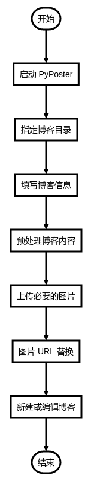

# PyPoster：轻量级的博客发布小工具
## 介绍
**PyPoster** 是一个采用 Python 3.5 编写的博客离线发布小工具，GUI 采用 `tkinter` 框架构建，所以可以在安装了 Python 运行环境的多种平台下使用它。`PyPoster` 目前还只是一个简单的原型，暂时只支持 Wordpress 博客的 XML-RPC 接口。

## 为什么会有 PyPoster
以前在 Windows 平台下，会经常使用 WizNote 写东西，然后使用 WizNote 的博客发布功能进行发布。但是切换到 Ubuntu 或者 Mac OS 后，就只能使用 WizNote 的开源版本了，可惜那个版本没有 Windows 平台那么强大，所以也没有博客发布工具。所以就一直希望能有这么一款小工具，可以协助发布离线编写的文章。一开始是想找找有没有别人写的类似的小工具，但是并没有发现。由于平时主要使用 Ubuntu 系统，所以想找到一款可以在这个平台上运行又符合需求的小工具着实不易。于是 **PyPoster** 就诞生了。

## 功能支持
**Note**: 由于目前只是 Prototype，所以暂时只支持少量用到的功能。
- [x] 支持命令行交互模式和 GUI 模式（GUI 和 PyPoster 可以分离）；
- [x] 支持 Markdown 格式的博客发布功能（没有像 WizNote 那样可将 Markdown 文档选渲染后再发布的功能，主要是想用网站自定义的 Markdown 主题）；
- [x] 支持媒体文件（主要是图片）的自动上传功能。

## 简要工作流程




## 安装 & 运行
- pass


## 使用流程
1. 创建一个目录，专门用于放置离线博客文档（Markdown格式）和相应的图片文件（`images` 目录）。
1. 使用你喜欢的编辑器创建并编辑你的博客文档（我喜欢使用 gedit 写 Markdown 博客）；如果期间需要插入图片，只需要将图片存放在与博客文档同目录下的 `images` 子目录，并在博客中引用图片即可（博客发布后会自动将图片地址替换成实际的 URL）。
1. 当你完成博客后，目录结构应该和下面的类似：

    ```
    example_post/（存放博客文档和图片的目录）
    ├── images  （存放图片的目录）
    │   └── pyposter_gui.png    （图片文件）
    └── PyPoster, 轻量级的博客发布小工具.md    （博客文档）
    ```

1. GUI 版本发布博客：
    1. `python3 pyposter_gui.py` 启动带有 GUI 的 PyPoster； 
    1. 点击**打开**按钮，选择存放博客的目录（如例子中给出的 `post_foo` 目录），然后根据提示，填写相应的信息后，点击**确定**按钮即可进行发布。

    

1. 命令行版本发布博客：
    1. `python3 pyposter.py` 启动 PyPoster；
    1. 根据提示填写信息，完成后即可发布；
    
    

## 小小说明
- 第一次发布完成后，会在博客目录下生成一个 `post.conf` 文件，它记录了发布成功后的博客的 `post_id` 和已经成功上传的图片名称。所以，还请不要删除这个配置文件。
- 后期在编辑博客文档后，会自动编辑已经存在的博客，而非新建。
- 博客配置文件 `post.conf` 格式如下：

    ```
    {
        "post_id": "post-id", 
        "posted_images": {
            "flow.png": "http://absolute-url-to-flow.png",
            "pyposter_gui.png": "http://absolute-url-to-pyposter_gui.png"
        }
    }
    ```

## 依赖
- [python-wordpress-xmlrpc](https://github.com/maxcutler/python-wordpress-xmlrpc)

## 贡献
- 可以提交 issue，帮助改进，谢谢；
- 可以根据需要，扩展功能；
- 如果有更好的类似工具，请推荐给我，多谢啦！

## 许可
Licensed under the [MIT](LICENSE.md) license. 
