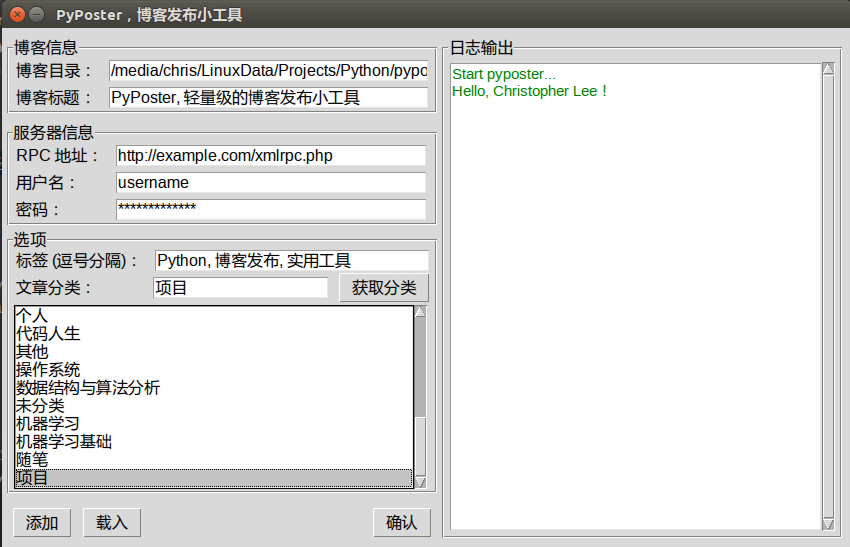
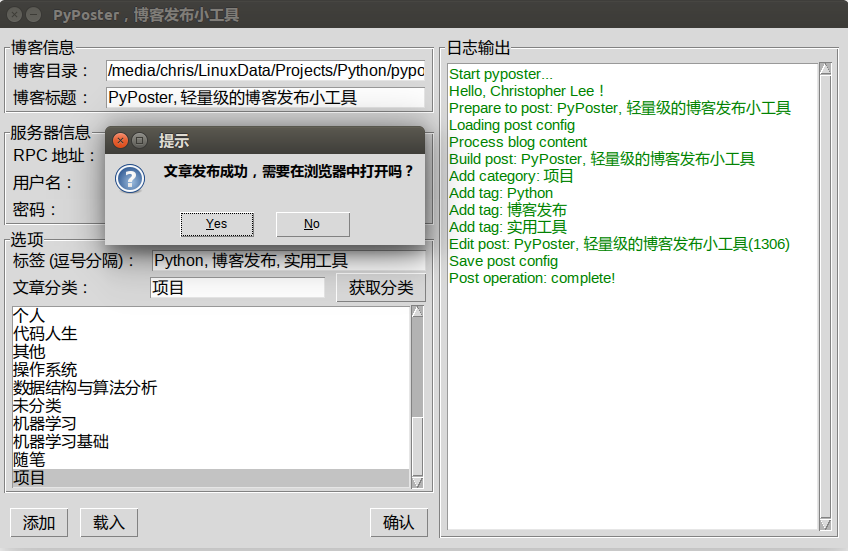

# PyPoster：轻量级的博客发布小工具
## 介绍
**PyPoster** 是一个采用 Python 3.5 编写的博客离线发布小工具，GUI 采用 `tkinter` 框架构建。理论上，可以在安装了 Python 运行环境的多种平台下使用它。`PyPoster` 目前还只是一个简单的原型，暂时只支持 Wordpress 博客的 XML-RPC 接口。项目地址：[https://github.com/chrisleegit/pyposter](https://github.com/chrisleegit/pyposter)。

## 为什么会有 PyPoster
以前在 Windows 平台下，会经常使用 WizNote 写东西，然后使用 WizNote 的博客发布功能进行发布。但是切换到 Ubuntu 或者 Mac OS 后，就只能使用 WizNote 的开源版本了，可惜那个版本没有 Windows 平台那么强大，所以也没有博客发布工具。所以就一直希望能有这么一款小工具，可以协助发布离线编写的文章。一开始是想找找有没有别人写的类似的小工具，但是并没有发现。由于平时主要使用 Ubuntu 系统，所以想找到一款可以在这个平台上运行又符合需求的小工具着实不易。于是 **PyPoster** 就诞生了。

## 已实现的功能
**Note**: 由于目前只是 Prototype，所以暂时只支持少量用到的功能。

- 提供命令行交互模式和 GUI 模式（当然推荐后者啦）；
- 服务器信息自动保存，密码采用 `PyCrypto` 模块中提供的加密算法进行加密后再存储；
- 博客发布功能（没有像 WizNote 那样可将 Markdown 文档选渲染后再发布的功能，主要是想用网站自定义的 Markdown 主题）：新建博客或自动编辑博客；
- 可以自动上传博客中引用的本地图片文件（需要位于博客文档的目录下的子目录 `images`中）;
- 博客发布成功后，会保存必要的信息，为后期编辑或防止重复上传图片等提供判断依据（目前功能还比较简单）。

## 简要工作流程


## 安装 & 运行
**Note：** 待功能稳定后，可能会发布打包好的版本，这样使用会更加方便。以下是在 Ubuntu 16.04 下测试安装的步骤，其他系统类似。

- 请 [下载](https://github.com/ChrisLeeGit/pyposter/releases) 最新的 pyposter 项目代码；
- 确保系统安装好 Python 3 运行环境；
- 解压 pyposter 源码包，并安装其中的 `requirements.txt` 中列出的依赖库：`pip3 install -r requirements.txt`；
- 进入 `src` 目录，运行 PyPoster：
    - `python3 pyposter.py`：进入 PyPoster 命令行交互模式；
    - `python3 pyposter_gui.py`：打开带有图形界面的 PyPoster。


## 使用流程
1. 创建一个目录，专门用于放置离线博客文档（Markdown 格式）和相应的图片文件（`images` 目录）。
1. 使用你喜欢的编辑器创建并编辑你的博客文档（我喜欢使用 gedit 写 Markdown 博客）；如果期间需要插入图片，只需要将图片存放在与博客文档同目录下的 `images` 子目录，并在博客中引用图片即可（博客发布后会自动将图片地址替换成实际的 URL）。
1. 当你完成博客后，目录结构应该和下面的类似（注意：不要在博客目录下存放其他文件，如额外的文档等，否则程序会出错！后期会改进这个问题）：

    ```
    example_post/（存放博客文档和图片的目录）
    ├── images  （存放图片的目录）
    │   └── pyposter_gui.png    （图片文件）
    └── PyPoster, 轻量级的博客发布小工具.md    （博客文档）
    ```

1. GUI 版本发布博客：
    1. 启动图形化版本的 PyPoster； 
    1. 添加博客所在的路径（两种方式）：
        1. 方式一：在路径框中手动填写博客路径；
        1. 方式二：点击左下角的**添加**按钮，选择博客所在目录。
        
    1. 载入博客文档（如果使用方式二添加，则会自动载入）：点击 `载入` 按钮，程序会自动加载博客目录（包括可能存在的配置），然后自动填充诸如标题、分类、标签等信息；
    1. 接下来，填写服务器信息：XML-RPC 地址，你的网站登录名和密码；
    1. 编辑相应的标签（多个标签使用英文逗号隔开）和博客分类等信息；你也可以点击按钮 `获取分类`，得到你的博客网站上所有分类，然后从中选择目录。
    1. 最后，待一切填写完毕，点击 `确定`按钮，即可开始发布。可以在右侧的日志输出框看到详细的过程。博客发布完成后，会弹出提示框。

    
    

1. 命令行版本发布博客（感兴趣可以试试）：
    1. `python3 pyposter.py` 启动 PyPoster；
    1. 根据提示填写信息，完成后即可发布；
    
    

## 小小说明
- 第一次发布完成后，会在博客目录下生成一个 `post.conf` 文件，它记录了发布成功后的博客的 `post_id` 和已经成功上传的图片名称等信息。所以，还请不要删除这个配置文件。
- 博客配置文件 `post.conf` 格式如下：

    ```
    {
        "title": "博客标题",
        "post_id": "博客 ID",
        "tags": "标签1, 标签2",
        "category": "博客分类",
        "posted_images": {
            "图片名称": "图片实际 URL"
        }
    }
    ```

## 依赖
- [python-wordpress-xmlrpc](https://github.com/maxcutler/python-wordpress-xmlrpc);
- [Python Cryptography Toolkit (pycrypto)](https://github.com/dlitz/pycrypto);

## 改进
**如果你对这个小工具感兴趣，并且愿意帮助完善的话，那是再好不过啦 :)**

- 如果觉得有什么好的想法或者改进建议，请在 [issues](https://github.com/ChrisLeeGit/pyposter/issues) 中提出；
- 也可以根据需要扩展功能；
- 此外，如果觉得代码写太烂，不妨帮忙重构；毕竟本人只是业余程序员，请见谅；
- 如果有不错的小工具，也不妨推荐给我，多谢啦！我喜欢自动化的小工具，可以解放双手，节约时间。

## 许可
[PyPoster](https://github.com/ChrisLeeGit/pyposter) 采用 [MIT](LICENSE.md) 许可协议。 
