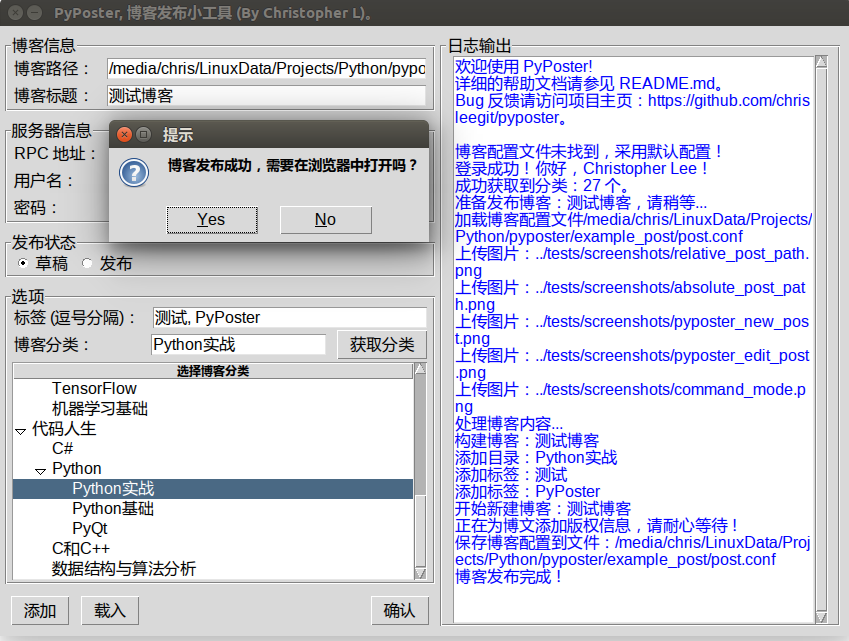
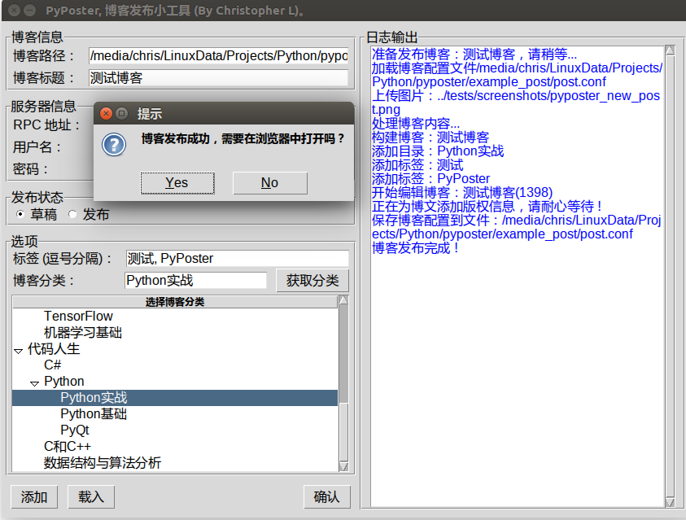

# PyPoster：轻量级的博客发布小工具
## 介绍
- **PyPoster** 是一个采用 Python 3.5 编写的博客离线发布小工具，GUI 采用 `tkinter` 框架构建。理论上，可以在安装了 Python 运行环境的多种平台下使用它。`PyPoster` 目前还比较简单，暂时只支持 WordPress 博客的 XML-RPC 接口。只需要指定本地的博客路径，即可一键发布！
- 项目地址：[https://github.com/chrisleegit/pyposter](https://github.com/chrisleegit/pyposter)。

## 为什么会有 PyPoster
以前在 Windows 平台下，会经常使用 WizNote 写东西，然后使用 WizNote 的博客发布功能进行发布。但是切换到 Ubuntu 或者 Mac OS 后，就只能使用 WizNote 的开源版本了，可惜那个版本没有 Windows 平台那么强大，所以也没有博客发布工具。所以就一直希望能有这么一款小工具，可以协助发布离线编写的文章。一开始是想找找有没有别人写的类似的小工具，但是并没有发现。由于平时主要使用 Ubuntu 系统，所以想找到一款可以在这个平台上运行又符合需求的小工具着实不易。于是 **PyPoster** 就诞生了。

## 已实现的功能
**Note**: 暂时只支持少量用到的功能，但是我觉得挺实用了。

- 支持命令行交互模式（测试使用）和 图形界面模式（强烈推荐使用带有图形界面的版本，操作简单）；
- 服务器信息自动保存，密码采用 `pycryto` 模块中提供的加密算法进行加密后再存储；
- 博客发布功能：新建博客或自动编辑博客（没有像 WizNote 那样可将 Markdown 文档选渲染后再发布的功能，主要是想用网站自定义的 Markdown 主题）；
- 博客发布时可以指定状态：__发布__ 和 __草稿__。

## 安装 & 运行
**Note：** 待功能稳定后，可能会发布打包好的版本，这样使用会更加方便。以下是在 Ubuntu 16.04 系统上安装并运行的步骤，其他系统类似。

- 请确保 [下载](https://github.com/ChrisLeeGit/pyposter/releases) 最新的 PyPoster 项目代码；
- 确保系统安装好 Python 3.x 运行环境；
- 解压 PyPoster 源码包，并安装其中的 `requirements.txt` 中列出的依赖库：`pip3 install -r requirements.txt`；
- 进入 `src` 目录，运行 PyPoster：
    - `python3 pyposter.py`：进入 PyPoster 命令行交互模式；
    - `python3 pyposter_gui.py`：打开带有图形界面的 PyPoster。


## 编写并发布博客你的博客
1. 推荐为你要写的博客创建一个本地目录，假设叫做 `example_post`。
1. 使用你喜欢的文本编辑器编写 Markdown 格式的博客（PyPoster 就是设计用来处理 Markdown 的博客，当然也可以是其他类型的咯，如HTML文档等，反正它都会帮你发布）。
1. 如果你需要在博客中引用本地图片，你可以直接在博客文档中指定本地图片的相对路径或绝对路径（事实上，PyPoster 足够智能，它能够在成功上传图片后自动将博客中的图片路径替换成实际的 URL）。我推荐的做法是将图片都放在一个文件夹下（如与博客同目录的 `images` 子目录中），这样的结构会更加清晰。__需要注意的是，PyPoster 是按照图片文件的 HASH 值来确保图片的唯一性的，所以只要多张图片的 HASH 值相同，就会被当成同一张图片，从而确保不会重复上传图片。__
1. 当你完成博客后，目录结构可能和下面的类似：

    ```
    example_post/（存放博客文档和图片的目录）
    ├── images  （存放图片的目录）
    │   └── pyposter_gui.png    （图片文件）
    └── PyPoster, 轻量级的博客发布小工具.md    （博客文档）
    ```

1. GUI 版本发布博客：
    1. 启动图形化版本的 PyPoster； 
    1. 添加博客所在的路径（两种方式）：
        1. 方式一：在路径框中手动填写博客相对或者绝对路径；
        1. 方式二：点击左下角的 `添加` 按钮，找到博客文档并添加。
        
    1. 载入博客文档（如果使用方式二添加，则会博客文档会被自动载入）：点击 `载入` 按钮，程序会自动加载博客文档，如果存在配置文件，则会自动加载配置文件；
    1. 接下来，填写服务器信息：XML-RPC 地址，你的网站登录名和密码（第一次需要填写，以后会自动读取配置）；
    1. 编辑相应的标签（多个标签使用英文逗号隔开）和博客分类等信息；你也可以点击按钮 `获取分类`，得到你的博客网站上所有分类，然后从中选择一个分类。
    1. 最后，待一切填写完毕，点击 `确定` 按钮，即可开始发布。可以在右侧的日志输出框看到详细的过程。博客发布完成后，会弹出提示框。
    1. 以下是运行截图（Ubuntu 16.04 系统）：
        - 加载相对路径博客：
        
        
        
        - 加载绝对路径博客（点击 `添加` 按钮选择更方便）：
        
        
        
        - 在 WordPress 网站上创建新的博客：
        
        
        
        - 编辑已经存在的博客，并将本地修改同步到 WordPress 网站：
        
        

1. 命令行版本发布博客（感兴趣的话可以试试）：
    1. `python3 pyposter.py` 启动 PyPoster；
    1. 根据提示填写信息，完成后即可发布。
    1. 命令行模式测试截图：
    
    

## 小小说明
- 第一次发布完成后，会在博客文档同目录下生成一个 名为`post.conf` 文件。那是一个非常重要的配置文件，与你的博客文档相关联（注意，不要将多个博客文档放在同一个目录，否则配置文件可能会相互覆盖）。每次在发布博客前，该配置文件都会被读取（如果没有会自动生成），然后会依据配置文件辨别哪些文件或内容发生了变动，从而防止图片或者博客重复发布。总之，一旦配置文件生成，就尽量不要删除，否则当你再次发布时，可能会再网站上看到相同的文章以及重复上传的图片。
- 每次博客或者图片发布成功后，都会在配置文件中记录对应的 HASH 值（目前采用 MD5 值），该 HASH 值是后期判断重复性操作的重要依据。
- 博客配置文件 `post.conf` 格式如下：

    ```
    {
        "posted_images": {
            "图片 HASH 值": [
                "图片本地路径",
                "图片发布后实际的URL"
            ]
        },
        "category": "博客分类",
        "tags": "标签1, 标签2",
        "checksum": "博客最后一次发布时的 HASH 值",
        "title": "博客标题（标题可以不同于博客实际的本地文件名）",
        "post_id": "博客发布后的 ID",
        "status": "publish/draft"
    }
    ```

## 依赖
- [python-wordpress-xmlrpc](https://github.com/maxcutler/python-wordpress-xmlrpc);
- [Python Cryptography Toolkit (pycrypto)](https://github.com/dlitz/pycrypto). 

## 改进
**如果你不小心看到了这里，并且对这个小工具感兴趣，愿意帮助完善的话，那将是一件令人兴奋的事情！ :)**

- 如果觉得有什么好的想法或者改进建议，请在 [issues](https://github.com/ChrisLeeGit/pyposter/issues) 中提出；
- 可以根据需要扩展功能；
- 如果有不错的小工具，也不妨推荐给我，多谢啦！我喜欢自动化的小工具，可以解放双手，节约时间。

## 主要参考
1. [python-wordpress-xmlrpc 文档](http://python-wordpress-xmlrpc.readthedocs.io/en/latest/)；
2. [pycrypto 相关模块 API 文档](https://www.dlitz.net/software/pycrypto/api/current/)；
3. [tkinter 主窗口居中显示](http://stackoverflow.com/questions/3352918/how-to-center-a-window-on-the-screen-in-tkinter)。

## 许可
[PyPoster](https://github.com/ChrisLeeGit/pyposter) 采用 [MIT](LICENSE.md) 许可协议。 
